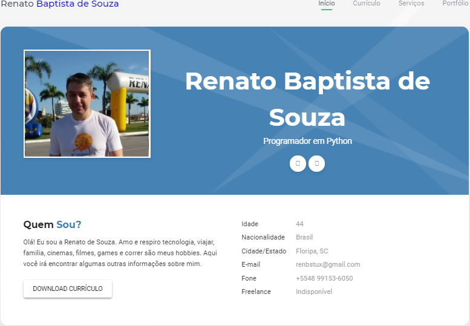

# renbstux.github.io
Meu Currículo Online

## Histórico de Atualizações

* 0.2.1
    * CHANGE: Atualização dos docs (o código não foi alterado)
* 0.2.0
    * CHANGE: Removida a função `setPadrãoXYZ()`
    * ADD: Adicionado a função `inicializar()`
* 0.1.1
    * FIX: Crash quando executava `escrever()` (Obrigado ao @Contribuidor)
* 0.1.0
    * O primeiro lançamento estável
    * CHANGE: Renomeado de `Projeto XYZ` para `Projeto ABC`
* 0.0.1
    * Projeto inicial

## Meta

Renato de Souza - [@renbstux](https://twitter.com/) - renbstux@gmail.com

Distribuído sobre a licença. Veja `LICENÇA` para mais informações.

[https://github.com/renbstux/renbstux.github.io](https://github.com/renbstux)
